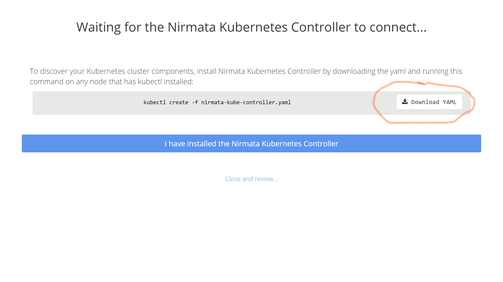

# Azure Kubernetes Services (AKS) and Nirmata Hackathon

In this tutorial, you will learn how to deploy a Kubernetes Cluster utilizing Azure Kubernetes Services (AKS), and how to deploy multi-tier applications on this Cluster utilizing Nirmata. The following steps will help you to accomplish the following:

* Configure AKS via Azure CLI
* Deploy a Managed Kubernetes cluster
* Configure Nirmata
* Manage Multi-tier Application


## Before you begin

* Make sure you have access to an [Azure Account](https://azure.microsoft.com/en-us/free/).
* The tutorial is wholly based on [Azure Cloud Shell](https://azure.microsoft.com/en-us/features/cloud-shell/) and the Azure Portal and does not require additional software installation on the client side.

## Azure Kubernetes Services Configuration

From Azure Cloud Shell on Azure Portal, perform the following steps:


* Create a [Resource Group](https://azure.microsoft.com/en-us/updates/resource-groups-in-azure-preview-portal/). Make sure you deploy it in a supported region for the Azure resource type 'Microsoft.ContainerService/managedClusters'. Using this command, ```az provider list --query "[?namespace=='Microsoft.ContainerService'].resourceTypes[]|[?contains(resourceType,'managedClusters')]"```, you can get more information on the regions that are currently supported.

```console
$ az group create --name myK8sRG --location centralus
```

Output:
```console
{
  "id": "/subscriptions/XXXXXXXX-XXXX-XXXX-XXXX-XXXXXXXXXXXX/resourceGroups/myK8sRG",
  "location": "centralus",
  "managedBy": null,
  "name": "myK8sRG",
  "properties": {
    "provisioningState": "Succeeded"
  },
  "tags": null
}
```

**Note:** The example above creates a resource group in Central US. As of mid May/2018, AKS is available on the following regions: East US (eastus), West Europe (westeurope), Central US (centralus), Canada Central (canadacentral), Canada East (canadaeast). Other regions will be available during GA.

* Before creating the AKS Cluster on the Resource Group created on the previous step, in case it is the first time you use this service on your Azure Subscription, you need to make sure the [Resource Provider](https://docs.microsoft.com/en-us/azure/azure-resource-manager/resource-manager-supported-services) is registered. The following command shows the status of your resource provider:

```console
az provider show --name "Microsoft.ContainerService" --query "{registrationState:registrationState}"

az provider show --name "Microsoft.Compute" --query "{registrationState:registrationState}"
```

Output in case it is not registered:
```console
{
  "registrationState": "NotRegistered"
}
```

In case it is ot registered, the "registrationState" object will show as "NotRegistered", and you should register it with the following command before proceeding:

```console
az provider register --namespace Microsoft.ContainerService --wait

az provider register --namespace Microsoft.Computer --wait
```

Repeat the commands to verify the registration status, and if it shows as "Registered", we are good to proceed.


* Deploy a Managed Kubernetes Cluster on [AKS](https://azure.microsoft.com/en-us/services/container-service/). This process will take 5 minutes approximately.

```console
$ az aks create --resource-group myK8sRG --name myK8sCluster --node-count 1 --generate-ssh-keys
```

Output:
```console
{
  "additionalProperties": {},
  "agentPoolProfiles": [
    {
      "additionalProperties": {},
      "count": 1,
      "dnsPrefix": null,
      "fqdn": null,
      "name": "nodepool1",
      "osDiskSizeGb": null,
      "osType": "Linux",
      "ports": null,
      "storageProfile": "ManagedDisks",
      "vmSize": "Standard_DS1_v2",
      "vnetSubnetId": null
    }
  ],
  "dnsPrefix": "myK8sClust-myK8sRG-30ec95",
  "fqdn": "myk8sclust-myk8srg-30ec95-407988ed.hcp.centralus.azmk8s.io",
  "id": "/subscriptions/XXXXXXXX-XXXX-XXXX-XXXX-XXXXXXXXXXXX/resourcegroups/myK8sRG/providers/Microsoft.ContainerService/managedClusters/myK8sCluster",
  "kubernetesVersion": "1.9.6",
  "linuxProfile": {
    "additionalProperties": {},
    "adminUsername": "azureuser",
    "ssh": {
      "additionalProperties": {},
      "publicKeys": [
        {
          "additionalProperties": {},
          "keyData": "ssh-rsa XXXXXXXXXXXXXXXXXXXXXXXXXXXXXXXXXXXXXXXXXXXXXXXXXXXXXXXXXXXXXXXXfkmmlWld7JKNdc7GwbxWbTFDu/4/Qe8X67+PBWNfPK3ywYpBNTYLjWzQx2BO/N97JwLW6HNfk/TpSFC3wASTcZnPIE4gbQ2bCHyPpyPSB+kv/RIwnwfohNrvoj5j8qRayRcHQuJe2rv+lRIpM0UEcaL7wOjOt50Pa0+oncvgOqxXLh67XpEf4sGhaBkE1AftJ/X/vjSXJB3YmZUMA7/Z4UtJv0+jXozOE3iw8U6nu2CTSDagXnf7/339w5MG/RtPlvLlF0NpBkvusaAutgPo74EkX"
        }
      ]
    }
  },
  "location": "centralus",
  "name": "myK8sCluster",
  "provisioningState": "Succeeded",
  "resourceGroup": "myK8sRG",
...
}
```

* Get credential

``` console
$ az aks get-credentials --resource-group myK8sRG --name myK8sCluster

```

Output:
```console
Merged "myK8sCluster" as current context in /home/<your-home-dir>/.kube/config
```

* Make sure you can access your cluster, and the STATUS is Ready

```console
$ kubectl get nodes
```

Output:
```console
NAME                       STATUS    ROLES     AGE       VERSION
aks-nodepool1-84578568-0   Ready     agent     8m        v1.9.6
```

Note that at the time this tutorial was written, the default version for the AKS cluster is v1.9.6. One of the benefits of managed K8s on Azure, is that you can upgrade it easily. We don't need to do it at this time.

## Nirmata Configuration

Register for Nirmata at:

  https://try.nirmata.io

If you already have a Nirmata account, you can  [log in](https://www.nirmata.io) or  [reset your credentials](https://www.nirmata.io/security/reset.html).

Once you are logged in to Nirmata, you will see the getting started wizard. You can skip this wizard
as we don't want to setup a new cluster and will discover the AKS cluster:


Next, select "Clusters" on the left navigation bar and then select "Add Cluster" on the top right. Then select the first option to discover and manage an existing Kubernetes Cluster:


You can then enter a name for your cluster, click on "Create Cluster and Discover Kubernetes Components":


On the next screen select the option to download the YAML declaration that installs the Nirmata
Kubernetes Controller on your cluster. 



You can copy & paste this YAML to a file in your Azure Cloud Shell. 

  <pre>
  nano nirmata.yml
  </pre>

Then use 'kubectl' to apply the YAML to your AKS cluster as follows::

  <pre>
  kubectl create -f nirmata.yml
  </pre>


You can verify that the Nirmata resources are created using the following command:

  <pre>
  kubectl -n nirmata get pods
  </pre>

Once the Nirmata Kubernetes Controller is running, you can go back to Nirmata and view your cluster resources:


## Manage Kubernetes Applications

Next, we will manage Kubernetes applications and workloads in Nirmata. 


### Create an Environment

The first step is to create an Environment. In Nirmata, a Kubernetes Cluster can be shared by 
multiple Enviroments. You can create Environments for each phase in your delivery pipeline (e.g.
dev-test, staging, production) or other usage. You can then assign policies and configuration to
Environments. 

Check the [Nirmata Documetation](https://docs.nirmata.io/en/latest/Introduction.html#core-concepts) for details on Environments.

To create an Environment, select 'Environments' from the left navigation panel and then 
click on "Add Environment" at the top right:


Once you have created an Environment you can now deploy and manage Kubernetes applications in it. Nex, let's create an Application.

### Create a Kubernetes Application

Save the following YAML file on your local file system as ghost.yml:

  <pre>
  kind: Pod
  apiVersion: v1
  metadata:
    name: ghost
  spec:
    containers:
    - name: ghost
      image: "ghost:1.9.1-alpine"
      ports:
      - containerPort: 2368
        protocol: "TCP"
  </pre>

In Nirmata, select **Catalog - Applications** in the left navigation bar and then click **Add Application** in the top right. Then click on **Import YAMLs** and select the ghost.yml file from above.


Click **Create** to create the application. You can then click **Run this application in an environment** and
enter a run name for your application. If you have multiple environments, you can also select the environment.

Click **Run Application** to start deploying the ghost application to your Kubernetes environment:


You can then manage the running application from Nirmata, for example scale-up or scale-down instances or update the image version.

### Import a Helm Chart

You can also import Applications from Helm Charts.

Select **Catalog** on the left navigation pane. Then select **Helm Charts** and click on the **Kubernetes Charts** repository. This will show you all available charts in the Kubernetes repository:


Next search for the "Redis" chart and click "Import". You can then view / customize the imported application.


To run the application, select **Run the application in an Environment** and enter in a run name. This will create a new running application in your environment.

## Clean Up

To delete the resources that were created, you can run the following command:

```console
$ az group delete --name myK8sRG
```

For questions or suggestions about this tutorial, you can reach out to [Paulo Renato](https://www.linkedin.com/in/paulorenato/) on the Azure section, and [Jim Bugwadia](https://www.linkedin.com/in/jimbugwadia/) on the Nirmata section.
