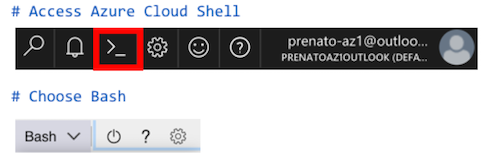

# <a name="security-labs"><a/>Azure Security Labs

In this tutorial, we have a series of mini labs related to different Azure security topics covered in greater detail as part of the "Azure Security Overview" session delivered by [Paulo Renato](https://www.linkedin.com/in/paulorenato/). The presentation can be shared upon request. The areas we chose for this tutorial are described as follow: 

* [Lab 1: Azure Networking](#azure-networking)
* [Lab 2: Identity & Access Management](#identity-and-access)
* [Lab 3: Data Access Management](#data-access)
* [Lab 4: Governance](#governance)
* [Lab 5: Unified Visibility Control](#unified-control)

## Before you begin

* Make sure you have access to an [Azure Account](https://azure.microsoft.com/en-us/free/).
* The tutorial is wholly based on [Azure Cloud Shell](https://azure.microsoft.com/en-us/features/cloud-shell/) and the [Azure Portal](https://portal.azure.com) and does not require additional software installation on the client side.

>**Note:** You are free to use your company's Azure subscription for this lab series, but make sure you have at least [contributor role](https://docs.microsoft.com/en-us/azure/role-based-access-control/built-in-roles#contributor) assigned to your user, as we will perform configuration that requires write access to the following resource providers: Networking, AAD, Storage Accounts and Policy. In case you do not have contributor access to your subscription, you can still apply for a free Azure account using the first link above.

# <a name="azure-networking"></a>Lab 1: Azure Networking

This mini-lab will focus on the capabilities to filter network traffic with network security group.

The following lab, [Filter Networking Traffic Tutorial](https://docs.microsoft.com/en-us/azure/virtual-network/tutorial-filter-network-traffic-cli) is used a placeholder until I bring this specific lab back.

[Return to Table of Contents](#security-labs)

# <a name="identity-and-access"></a>Lab 2: Identity & Access Management

This mini-lab will focus on [Managed Identities](https://docs.microsoft.com/en-us/azure/active-directory/managed-identities-azure-resources/overview).

From Azure Cloud Shell on [Azure Portal](https://portal.azure.com), perform the following steps:



#### Create a [Resource Group](https://docs.microsoft.com/en-us/azure/azure-resource-manager/resource-group-overview#resource-groups).

```
$ az group create --name myLab2RG --location eastus2
```

Output:
```console
{
  "id": "/subscriptions/XXXXXXXX-XXXX-XXXX-XXXX-XXXXXXXXXXXX/resourceGroups/myLab2RG",
  "location": "eastus2",
  "managedBy": null,
  "name": "myLab2RG",
  "properties": {
    "provisioningState": "Succeeded"
  },
  "tags": null
}
```

>**Note:** You will need your Azure Subscription ID for some of the steps below. To get the subscription ID, run the command `az account list` from the Cloud Shell prompt.


#### Create a Virtual Machine on the resource group that was created in the previous steps

```
$ az vm create \
  --resource-group myLab2RG \
  --name myLab2VM1 \
  --image UbuntuLTS \
  --admin-username azureuser \
  --generate-ssh-keys
```

>**Note:** The command `--generate-ssh-keys` will use the existing SSH files `~/.ssh/id_rsa` and `~/.ssh/id_rsa.pub`. In case these files do not exist, they will be created as part of the `az vm create` command execution.

Output:

```console
{
  "fqdns": "",
  "id": "/subscriptions/XXXXXXXX-XXXX-XXXX-XXXX-XXXXXXXXXXXX/resourceGroups/myVMRG/providers/Microsoft.Compute/virtualMachines/myLab2VM1",
  "location": "eastus2",
  "macAddress": "AA-BB-CC-DD-EE-FF",
  "powerState": "VM running",
  "privateIpAddress": "10.0.0.4",
  "publicIpAddress": "40.70.131.116",
  "resourceGroup": "myLab2RG",
  "zones": ""
}
```
>**Note:** We will use the `publicIpAddress` from the output above in order to login into the VM.


#### Grant permission to read your Azure Resource Group

Use az vm identity assign with the identity assign command enable the system-assigned identity to an existing VM:

```
$ az vm identity assign --resource-group myLab2RG --name myLab2VM1
```

>**Note:** We could create the VM with its identity assigned by adding the parameter `--assign-identity`, as explained [here](https://docs.microsoft.com/en-us/azure/active-directory/managed-identities-azure-resources/qs-configure-cli-windows-vm#system-assigned-managed-identity).

Output:

```console
{
  "systemAssignedIdentity": "aa5a8fa2-4e31-4bc7-99ea-4af10269d783",
  "userAssignedIdentities": {}
}
```

>**Note:** The UUID `aa5a8fa2-4e31-4bc7-99ea-4af10269d783` is an example and you may use your information.

List the VM MSI Identity (`principalId`) that will be used to assign a role to the VM, which should match the `systemAssignedIdentity` from the previous output:

```
$ MSIdentity=`az resource list -n myLab2VM1 --query [*].identity.principalId -o json | jq .[0] -r`
```

Assign "Reader" role to the VM for the resource group scope. Make sure you replace `XXXXXXXX-XXXX-XXXX-XXXX-XXXXXXXXXXXX` with your real subscription id.

```
$ az role assignment create --assignee $MSIdentity --role reader --scope /subscriptions/XXXXXXXX-XXXX-XXXX-XXXX-XXXXXXXXXXXX/ResourceGroups/myLab2RG
```

Output:

```console
{
  "canDelegate": null,
  "id": "/subscriptions/XXXXXXXX-XXXX-XXXX-XXXX-XXXXXXXXXXXX/ResourceGroups/myLab2RG/providers/Microsoft.Authorization/roleAssignments/aa5a8fa2-4e31-4bc7-99ea-4af10269d783",
  "name": "fa0c59bb-08f7-4a20-a4b3-2186a7c6d358",
  "principalId": "aa5a8fa2-4e31-4bc7-99ea-4af10269d783",
  "resourceGroup": "myLab2RG",
  "roleDefinitionId": "/subscriptions/XXXXXXXX-XXXX-XXXX-XXXX-XXXXXXXXXXXX/providers/Microsoft.Authorization/roleDefinitions/acdd72a7-3385-48ef-bd42-f606fba81ae7",
  "scope": "/subscriptions/XXXXXXXX-XXXX-XXXX-XXXX-XXXXXXXXXXXX/ResourceGroups/myLab2RG",
  "type": "Microsoft.Authorization/roleAssignments"
}
```

>**Note:** We are using system-assigned identity in this example. Be sure to review the [difference between a system-assigned and user-assigned managed identity](https://docs.microsoft.com/en-us/azure/active-directory/managed-identities-azure-resources/overview#how-does-it-work).

#### Go through the following steps in order to validate MSI


1. Login into the VM using the `publicIpAddress` information from the output after the VM creation

```
$ ssh azureuser@40.70.131.116
```

2. Request Access Token:

``` 
$ response=$(curl -H Metadata:true "http://169.254.169.254/metadata/identity/oauth2/token?api-version=2018-02-01&resource=https%3A%2F%2Fmanagement.azure.com/")
```

3. Parse Access Token Value:

``` 
$ access_token=$(echo $response | python -c 'import sys, json; print (json.load(sys.stdin)["access_token"])') 
```

4. Use the Token to query an Azure API. Make sure you replace XXXXXXXX-XXXX-XXXX-XXXX-XXXXXXXXXXXX with your real subscription id:

```
$ SubID="XXXXXXXX-XXXX-XXXX-XXXX-XXXXXXXXXXXX"
$ RG="myLab2RG"

$ url="https://management.azure.com/subscriptions/$SubID/resourceGroups/$RG?api-version=2016-09-01"

$ curl $url -H "x-ms-version: 2017-11-09" -H "Authorization: Bearer $access_token"
```

>**Note:** The output below is an example of a successful resource query, validating you have access to the endpoint through the permissions that were given to the VM (Reader role at the Resource Group scope).

Output:
```console
{"id":"/subscriptions/XXXXXXXX-XXXX-XXXX-XXXX-XXXXXXXXXXXX/resourceGroups/myLab2RG","name":"myLab2RG","location":"eastus2","properties":{"provisioningState":"Succeeded"}}
```

>**Note:** In case you want to validate how MSI works, you can remove the role previously assigned and run the tests again.

```
$ az role assignment delete --assignee XXXXXXXX-XXXX-XXXX-XXXX-XXXXXXXXXXXX --role reader --scope /subscriptions/XXXXXXXX-XXXX-XXXX-XXXX-XXXXXXXXXXXX/ResourceGroups/myLab2RG
```

Now, run the 4th step again (`curl $url -H "x-ms-version: 2017-11-09" -H "Authorization: Bearer $access_token"`) from within the VM we configured, and you may notice an error message due to the access removal.

Output:

```console
{"error":{"code":"AuthorizationFailed","message":"The client 'f4011a26-1eec-4083-a2c2-ce173dca00bc' with object id 'f4011a26-1eec-4083-a2c2-ce173dca00bc' does not have authorizationto perform action 'Microsoft.Resources/subscriptions/resourceGroups/read' over scope '/subscriptions/XXXXXXXX-XXXX-XXXX-XXXX-XXXXXXXXXXXX/resourceGroups/myLab2RG'."}}
```

#### Lab resources cleanup:

To delete the resources that were created as part of this lab, you can run the following command:

```
$ az group delete --name myLab2RG
```

[Return to Table of Contents](#security-labs)

# <a name="data-access"></a>Lab 3: Data Access Management

This mini-lab will focus on [Shared Access Signature](https://docs.microsoft.com/en-us/azure/storage/common/storage-dotnet-shared-access-signature-part-1).

From Azure Cloud Shell on [Azure Portal](https://portal.azure.com), perform the following steps:


#### Create a [Resource Group](https://docs.microsoft.com/en-us/azure/azure-resource-manager/resource-group-overview#resource-groups).

```
$ az group create --name myLab3RG --location eastus2
```

Output:
```console
{
  "id": "/subscriptions/XXXXXXXX-XXXX-XXXX-XXXX-XXXXXXXXXXXX/resourceGroups/myLab3RG",
  "location": "eastus2",
  "managedBy": null,
  "name": "myLab3RG",
  "properties": {
    "provisioningState": "Succeeded"
  },
  "tags": null
}
```

#### Create Storage Account

>**Important:** The Storage account name is global and unique, so you need to use a random name. In the following example we are using `mylab3stgacct`. Note that it accepts between 3-24 characters and all lower-case.

```
$ az storage account create --name mylab3stgacct --resource-group myLab3RG --sku Standard_LRS --location eastus2
```

Output:

```console
{
  "accessTier": null,
  "creationTime": "2018-10-31T18:17:51.904889+00:00",
  "customDomain": null,
  "enableHttpsTrafficOnly": false,
  "encryption": {
    "keySource": "Microsoft.Storage",
    "keyVaultProperties": null,
    "services": {
      "blob": {
        "enabled": true,
        "lastEnabledTime": "2018-10-31T18:17:52.108026+00:00"
      },
      "file": {
        "enabled": true,
        "lastEnabledTime": "2018-10-31T18:17:52.108026+00:00"
      },
      "queue": null,
      "table": null
    }
    ...
    <removed output>
}
```

#### Create a storage container to store blobs

```
$ az storage container create --name mylab3stgcontainer --account-name mylab3stgacct
```

Output:

```console
{
  "created": true
}
```

#### Create Stored Access Policy for the container

First, let us see if there is any policy associated to the storage container recently created:

```
$ az storage container policy list --container mylab3stgcontainer --account-name mylab3stgacct
```

Output:

```console
{}
```

As we could see, no stored policy is associated with the container created above. Now, let us create the `Stored Access Policy` for the container:

```console
$ start=`date -d "-30 minutes" '+%Y-%m-%dT%H:%MZ'`
$ end=`date -d "30 minutes" '+%Y-%m-%dT%H:%MZ'`
$ az storage container policy create --name mylab3policy1 --container-name mylab3stgcontainer --account-name mylab3stgacct --permissions dwrl --start $start --expiry $end
```

Output:

```console
{
  "etag": "\"0x8D63F5F5F4222C3\"",
  "lastModified": "2018-10-31T18:33:37+00:00"
}
```

Execute the command below to liste the pol

```
$ az storage container policy list --container mylab3stgcontainer --account-name mylab3stgacct
```

Output:

```console
{
  "mylab3policy1": {
    "expiry": null,
    "permission": "rwdl",
    "start": null
  }
}
```

#### Create a SAS key based on Stored Access Policy

```
$ az storage container generate-sas --name mylab3stgcontainer --account-name mylab3stgacct --policy-name mylab3policy1
```

Output:

```console
"sv=2018-03-28&si=mylab3policy1&sr=c&sig=71zzMlgFsRhNiqiBirNlWNAN8zQVdv0Xi36Q2SKoKNo%3D"
```

#### Test Access to the Storage Container

Upload a file to the storage account:

```
$ sas="sv=2018-03-28&si=mylab3policy1&sr=c&sig=71zzMlgFsRhNiqiBirNlWNAN8zQVdv0Xi36Q2SKoKNo%3D"

$ echo "MyLab3 Upload Test" > MyLab3File.txt

$ az storage blob upload --name MyLab3File.txt --container-name mylab3stgcontainer --account-name mylab3stgacct --file MyLab3File.txt --sas-token $sas 
```

Validate you can access the blob as follow:

```
$ curl "https://mylab3stgacct.blob.core.windows.net/mylab3stgcontainer/MyLab3File.txt?"$sas
```

>**Note:** As you append the SAS key value to the URL, it will look like this:  `https://storage account name and Azure URL/the container name/the filename?the sas-key value`.


Update the `Stored Access Policy` expiring date and try to access it again, as follow:

```
$ start=`date -d "-30 minutes" '+%Y-%m-%dT%H:%MZ'`
$ end=`date -d "-30 minutes" '+%Y-%m-%dT%H:%MZ'`
$ az storage container policy update --name mylab3policy1 --container-name mylab3stgcontainer --account-name mylab3stgacct --permissions dwrl --start $start --expiry $end
```

Output:

```console
{
  "etag": "\"0x8D63F75B3FE941A\"",
  "lastModified": "2018-10-31T21:13:28+00:00"
}
```

If you try to access the same blob, you should get an error message, as follow:

```
$ curl "https://mylab3stgacct.blob.core.windows.net/mylab3stgcontainer/MyLab3File.txt?"$sas
```

Output:

```xml
<?xml version="1.0" encoding="UTF-8"?>
<Error>
   <Code>AuthenticationFailed</Code>
   <Message>Server failed to authenticate the request. Make sure the value of Authorization header is formed correctly including the signature.
RequestId:4c9acbf6-601e-00b1-455e-714e6b000000
Time:2018-10-31T21:14:09.2705135Z</Message>
   <AuthenticationErrorDetail>Signed expiry time [Wed, 31 Oct 2018 20:43:00 GMT] has to be after signed start time [Wed, 31 Oct 2018 20:43:00 GMT]</AuthenticationErrorDetail>
</Error>
```

>**Note:** If you update the `start` and `end` dates on the policy, the access can be restablished.


#### Lab resources cleanup:

To delete the resources that were created as part of this lab, you can run the following command:

```
$ az group delete --name myLab3RG
```

[Return to Table of Contents](#security-labs)

# <a name="governance"></a>Lab 4: Governance

This mini-lab will focus on [Azure Resource Manager Policy](https://docs.microsoft.com/en-us/azure/governance/policy/overview). Here you will see how to restrict a deployment to a given region.
You can find other policy samples [here](https://docs.microsoft.com/en-us/azure/governance/policy/samples/).

From Azure Cloud Shell on [Azure Portal](https://portal.azure.com), perform the following steps:


#### Prerequesites

Register the Policy Insights resource provider using Azure CLI. Registering the resource provider makes sure that your subscription works with it. To register a resource provider, you must have permission to perform the register action operation for the resource provider. This operation is included in the Contributor and Owner roles. Run the following command to register the resource provider:

```
$ az provider register --namespace 'Microsoft.PolicyInsights'
```

#### Create a [Resource Group](https://docs.microsoft.com/en-us/azure/azure-resource-manager/resource-group-overview#resource-groups).

```
$ az group create --name myLab4RG --location eastus2
```

#### Define and Assign the ARM Policy

In our example, we will define a policy that restricts deployment to West US 2 region. Create a policy definition with the following command.

```
$ az policy definition create --name MyallowedLocations --display-name MyallowedLocations --rules '{
                            "if": {
                                "not": {
                                    "field": "location",
                                    "in": ["westus2"] 
                                }
                            },
                            "then": {
                                "effect": "deny"
                            }
                        }'
```

Output:

```console
{
  "description": null,
  "displayName": null,
  "id": "/subscriptions/XXXXXXXX-XXXX-XXXX-XXXX-XXXXXXXXXXXX/providers/Microsoft.Authorization/policyDefinitions/MyallowedLocations",
  "metadata": null,
  "mode": null,
  "name": "MyallowedLocations",
  "parameters": {},
  "policyRule": {
    "if": {
      "not": {
        "field": "location",
        "in": [
          "westus2"
        ]
      }
    },
    "then": {
      "effect": "deny"
    }
  },
  "policyType": "Custom",
  "type": "Microsoft.Authorization/policyDefinitions"
}
```

Now, let's assign the policy to the subscription scope. Don't forget to replace `XXXXXXXX-XXXX-XXXX-XXXX-XXXXXXXXXXXX` with your subscription ID.

```console
$ az policy assignment create --policy MyallowedLocations --name MyallowedLocations --display-name MyallowedLocations --scope /subscriptions/XXXXXXXX-XXXX-XXXX-XXXX-XXXXXXXXXXXX
```

Output:

```console
{
  "description": null,
  "displayName": null,
  "id": "/subscriptions/XXXXXXXX-XXXX-XXXX-XXXX-XXXXXXXXXXXX/providers/Microsoft.Authorization/policyAssignments/4a5cdb94-7b3a-4d5d-9efa-a3f1dd7c5ddb",
  "metadata": null,
  "name": "4a5cdb94-7b3a-4d5d-9efa-a3f1dd7c5ddb",
  "notScopes": null,
  "parameters": null,
  "policyDefinitionId": "/subscriptions/XXXXXXXX-XXXX-XXXX-XXXX-XXXXXXXXXXXX/providers/Microsoft.Authorization/policyDefinitions/MyallowedLocations",
  "scope": "/subscriptions/XXXXXXXX-XXXX-XXXX-XXXX-XXXXXXXXXXXX",
  "sku": {
    "name": "A0",
    "tier": "Free"
  },
  "type": "Microsoft.Authorization/policyAssignments"
}
```

#### Test the policy

Let's try to create a resource (VM) in in the resource group `myLab4RG`:

```
$ az vm create \
  --resource-group myLab4RG \
  --name myLab4Vm \
  --image UbuntuLTS \
  --admin-username azureuser \
  --generate-ssh-keys
```

If the policy was applied correctly, the deployment will fail with the following error message:

```console
Azure Error: InvalidTemplateDeployment
Message: The template deployment failed with multiple errors. Please see details for more information.
Exception Details:
	Error Code: RequestDisallowedByPolicy
	Message: Resource 'myLab4VmVNET' was disallowed by policy. Policy identifiers: '[{"policyAssignment":{"name":"2469dc55-706d-4cef-8a17-ad6076e8160a","id":"/subscriptions/XXXXXXXX-XXXX-XXXX-XXXX-XXXXXXXXXXXX/providers/Microsoft.Authorization/policyAssignments/2469dc55-706d-4cef-8a17-ad6076e8160a"},"policyDefinition":{"name":"MyallowedLocations","id":"/subscriptions/XXXXXXXX-XXXX-XXXX-XXXX-XXXXXXXXXXXX/providers/Microsoft.Authorization/policyDefinitions/MyallowedLocations"}},{"policyAssignment":{"name":"4a5cdb94-7b3a-4d5d-9efa-a3f1dd7c5ddb","id":"/subscriptions/XXXXXXXX-XXXX-XXXX-XXXX-XXXXXXXXXXXX/providers/Microsoft.Authorization/policyAssignments/4a5cdb94-7b3a-4d5d-9efa-a3f1dd7c5ddb"},"policyDefinition":{"name":"MyallowedLocations","id":"/subscriptions/XXXXXXXX-XXXX-XXXX-XXXX-XXXXXXXXXXXX/providers/Microsoft.Authorization/policyDefinitions/MyallowedLocations"}}]'.
	Target: myLab4VmVNET
```

>**Note:** The resource group `myLab4RG` was created in the `East US 2` region, while the policy restricts the deployment at `West US 2`.


#### Lab resources cleanup:

To delete the resources that were created as part of this lab, you can run the following commands:

```
$ az group delete --name myLab4RG

$ az policy assignment delete --name MyallowedLocations

$ az policy definition delete --name MyallowedLocations 
```

[Return to Table of Contents](#security-labs)

# <a name="unified-control"></a>Lab 5: Unified Visibility Control

For the Unified Visibility Control, you can leverage the [Azure Log Analytics Demo](https://portal.loganalytics.io/demo#/discover/home) environment which includes an pre-built lab that allows you to test and validate the main concepts of Log Analytics, its powerful query language, and the ability to create charts and dashboars.

I plan to add more labs in this section in the future.

[Return to Table of Contents](#security-labs)

