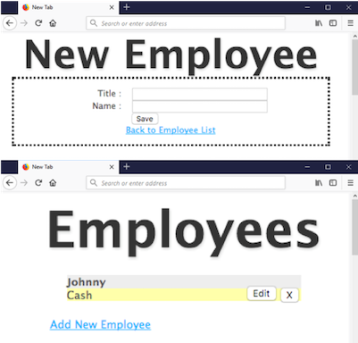

# Azure Kubernetes Services (AKS) Demo

In this tutorial, you will learn how to deploy a Kubernetes Cluster utilizing Azure Kubernetes Services (AKS). The following steps will help you to accomplish the following:

* Configure AKS via Azure CLI
* Deploy a Managed Kubernetes cluster
* Configure persistent volume on AKS 
* Deploy a multi-tier Open Source app
* Validate access to the Application

The multi-tier app is based on the [MEAN stack](http://mean.io/). Additional information about it can be obtained in the ["app"](https://github.com/prwitt/azure-demos/tree/master/kubernetes/app) folder from the same git repository. The following diagram shows how the app looks like:


## Before you begin

* Make sure you have access to an [Azure Account](https://azure.microsoft.com/en-us/free/).
* The tutorial is wholly based on [Azure Cloud Shell](https://azure.microsoft.com/en-us/features/cloud-shell/) and the Azure Portal and does not require additional software installation on the client side.

## Azure Kubernetes Services Configuration

From Azure Cloud Shell on Azure Portal, perform the following steps:


* Create a [Resource Group](https://azure.microsoft.com/en-us/updates/resource-groups-in-azure-preview-portal/). Make sure you deploy it in a supported region for the Azure resource type 'Microsoft.ContainerService/managedClusters' - at the moment we wrote this tutorial, only Azure regions eastus/westeurope/centralus are supported.

```console
$ az group create --name myK8sRG --location centralus
```

Output:
```console
{
  "id": "/subscriptions/XXXXXXXX-XXXX-XXXX-XXXX-XXXXXXXXXXXX/resourceGroups/myK8sRG",
  "location": "centralus",
  "managedBy": null,
  "name": "myK8sRG",
  "properties": {
    "provisioningState": "Succeeded"
  },
  "tags": null
}
```

* Deploy a Managed Kubernetes Cluster on [AKS](https://azure.microsoft.com/en-us/services/container-service/). This process will take 5 minutes approximately.

```console
$ az aks create --resource-group myK8sRG --name myK8sCluster --node-count 1 --generate-ssh-keys
```

Output:
```console
{
  "id": "/subscriptions/XXXXXXXX-XXXX-XXXX-XXXX-XXXXXXXXXXXX/resourcegroups/myK8sRG/providers/Microsoft.ContainerService/managedClusters/myK8sCluster",
  "location": "centralus",
  "name": "myK8sCluster",
  "properties": {
    "accessProfiles": {
      "clusterAdmin": {
          ...
          **removed part of the output**
          ...
    "provisioningState": "Succeeded",
    "servicePrincipalProfile": {
      "clientId": "XXXXXXXX-XXXX-XXXX-XXXX-XXXXXXXXXXXX",
      "keyVaultSecretRef": null,
      "secret": null
    }
  },
  "resourceGroup": "myK8sRG",
  "tags": null,
  "type": "Microsoft.ContainerService/ManagedClusters"
}          
```

* Get credential

``` console
$ az aks get-credentials --resource-group myK8sRG --name myK8sCluster

```

Output:
```console
Merged "myK8sCluster" as current context in /home/<your-home-dir>/.kube/config
```

* Make sure you can access your cluster, and the STATUS is Ready

```console
$ kubectl get nodes

```

Output:
```console
NAME                       STATUS    ROLES     AGE       VERSION
aks-nodepool1-82441409-0   Ready     agent     2m        v1.7.7
```

Note that at the time this tutorial was written, the default version for the AKS cluster is v1.7.7. One of the benefits of managed K8s on Azure, is that you can upgrade it easily. We don't need to do it at this time.


## Application Deployment

* From Azure Cloud Shell, run the following command to download the YAML files we'll use to create our application:

```console
$ for i in `echo db-controller.yaml db-service.yaml pvc-azuredisk.yaml web-controller.yaml web-service.yaml`
do
wget https://raw.githubusercontent.com/prwitt/azure-demos/master/kubernetes/$i
done
```

### Creating the Database Service

The following components will be deployed to support the Database::

* Persistent Volume to store the data (pods are ephemeral, so we shouldn't save data locally)
* Replication Controller running MongoDB
* Service mapping to that Replication Controller


To create the disk, run the following command:

```console
From the directory where you have pvc-azuredisk.yaml:

$ kubectl create -f pvc-azuredisk.yaml
```

Output:
```console
persistentvolumeclaim "pvc-azuredisk" created
```

Let's see the private volume creation status:

```console
$ watch kubectl describe pvc
```

Output:
```console
Name:          pvc-azuredisk
Namespace:     default
StorageClass:  default
Status:        Bound
Volume:        pvc-b5939d88-d80a-11e7-851c-0a58ac1f0520
Labels:        <none>
Annotations:   pv.kubernetes.io/bind-completed=yes
               pv.kubernetes.io/bound-by-controller=yes
               volume.beta.kubernetes.io/storage-class=default
               volume.beta.kubernetes.io/storage-provisioner=kubernetes.io/azure-disk
Capacity:      1Gi
Access Modes:  RWO
Events:
  Type    Reason                 Age   From                         Message
  ----    ------                 ----  ----                         -------
  Normal  ProvisioningSucceeded  20s   persistentvolume-controller  Successfully provisioned volume pvc-b5939d88-d80a-11e7-851c-0a58ac1f0520 using kubernetes.io/azu
re-disk
```

**Note:** Wait until the PVC creation is successfull before moving to the next step.

Now, let's create the Replication controller that will run the database. The Replication Controller will ensure to restart the DB automatically if needed.

``` console
From the directory where you have the file db-controller.yaml:

$ kubectl create -f db-controller.yaml
```

Let's monitor the creation status is **Running**:
```console
$ watch kubectl get pods

NAME                     READY     STATUS    RESTARTS   AGE
mongo-controller-bmz15   1/1       Running   0          2m

```

* Now, let's create the Service that will expose the access to the Database:

```console
From the directory where you have the file db-service.yaml:

$ kubectl create -f db-service.yaml
```

Output:
```console
service "mongo" created

```

* Let's see what we created so far:


```console
$ kubectl get rc
NAME               DESIRED   CURRENT   READY     AGE
mongo-controller   1         1         1         4m


$ kubectl get pods
NAME                     READY     STATUS    RESTARTS   AGE
mongo-controller-bmz15   1/1       Running   0          4m


$ kubectl get svc
NAME         TYPE        CLUSTER-IP    EXTERNAL-IP   PORT(S)     AGE
kubernetes   ClusterIP   10.0.0.1      <none>        443/TCP     1h
mongo        ClusterIP   10.0.212.66   <none>        27017/TCP   1m
```

### Web Server Deployment

The Web and App tiers are comprised by the following components: a Web Replication Controller that will ensure the Web Pods are running (they restart automatically), and the Service that will expose your Pod to the Internet.

* To deploy the Web Replication Controller:

``` console
From the directory where you have the file web-controller.yaml:

$ kubectl create -f web-controller.yaml
```

Output:
```console
replicationcontroller "web-controller" created
```

**Note:** The Web Replication Controller utilizes a docker image called prenato/myjsapp that is available in my public repository on [Docker Hub](https://hub.docker.com/r/prenato/myjsapp/).

* And finnaly, the Web Service that will expose external access to the web service:

``` console
From the directory where you have the file web-service.yaml:

$ kubectl create -f web-service.yaml
```

* Let's monitor the creation of the Web Service until it gets a public IP Address, as follow:

``` console

$ watch kubectl get svc

NAME         TYPE           CLUSTER-IP     EXTERNAL-IP   PORT(S)        AGE
kubernetes   ClusterIP      10.0.0.1       <none>        443/TCP        1h
mongo        ClusterIP      10.0.212.66    <none>        27017/TCP      4m
web          LoadBalancer   10.0.181.147   51.143.90.114 80:30780/TCP   1m
```

* Now, let's review again what we have created in this tutorial:

``` console

# A Persistent Volume to be used by the MongoDB

$ kubectl get pvc
NAME            STATUS    VOLUME                                     CAPACITY   ACCESS MODES   STORAGECLASS   AGE
pvc-azuredisk   Bound     pvc-b5939d88-d80a-11e7-851c-0a58ac1f0520   1Gi        RWO            default        12m

# Replication Controllers to ensure MongoDB has at least one Pod running, and Web has at least two Pods running.

$ kubectl get rc
NAME               DESIRED   CURRENT   READY     AGE
mongo-controller   1         1         1         9m
web-controller     2         2         2         3m

# The Pods were created by the Replication Controllers

$ kubectl get pods
NAME                     READY     STATUS    RESTARTS   AGE
mongo-controller-bmz15   1/1       Running   0          10m
web-controller-7mwlw     1/1       Running   0          3m
web-controller-wjhnv     1/1       Running   0          3m

# Services to expose 1) Access to MongoDB and 2) External Access to the Web App.

$ kubectl get svc
NAME         TYPE           CLUSTER-IP     EXTERNAL-IP     PORT(S)        AGE
kubernetes   ClusterIP      10.0.0.1       <none>          443/TCP        1h
mongo        ClusterIP      10.0.212.66    <none>          27017/TCP      7m
web          LoadBalancer   10.0.181.147   1.1.1.1         80:30780/TCP   3m

```


## Accessing the Application

Now that the Kubernetes Cluster was created, and the respective containers were deployed, let's find out what is the IP address to access our application:

```console

$ kubectl get svc

NAME         TYPE           CLUSTER-IP     EXTERNAL-IP     PORT(S)        AGE
kubernetes   ClusterIP      10.0.0.1       <none>          443/TCP        1h
mongo        ClusterIP      10.0.212.66    <none>          27017/TCP      7m
web          LoadBalancer   10.0.181.147   1.1.1.1         80:30780/TCP   3m


In the example above, our App Public IP Address is: 1.1.1.1

```

In the example above, the IP Address is: 1.1.1.1


If all the steps above were performed successfully, we should get a web application with access to a MongoDB, where you can insert/delete Employee information, as follow:




## Clean Up

To delete the resources that were created, you can run the following command:

```console
$ az group delete --name myK8sRG
```

For questions or suggestions about this tutorial, you can reach out to [Paulo Renato](https://www.linkedin.com/in/paulorenato/).


## Bonus Labs

If you finished this lab and want to play more with Containers on Azure, I recommend for you to try out the following labs:

[ACI Demo](https://github.com/rbitia/aci-demos)
[Jenkins Integration with Azure Container Service and Kubernetes](https://docs.microsoft.com/en-us/azure/container-service/kubernetes/container-service-kubernetes-jenkins)
